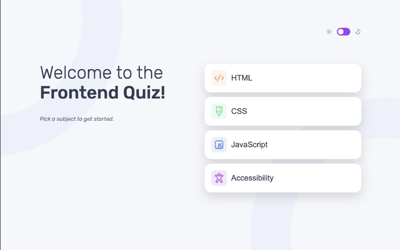

# Frontend Mentor - Frontend quiz app solution

This is a solution to the [Frontend quiz app challenge on Frontend Mentor](https://www.frontendmentor.io/challenges/frontend-quiz-app-BE7xkzXQnU). Frontend Mentor challenges help you improve your coding skills by building realistic projects.

## Table of contents

- [Overview](#overview)
  - [The challenge](#the-challenge)
  - [Screenshot](#screenshot)
  - [Links](#links)
- [My process](#my-process)
  - [Built with](#built-with)
  - [What I learned](#what-i-learned)
  - [Useful resources](#useful-resources)
- [Author](#author)

## Overview

### The challenge

Users should be able to:

- Select a quiz subject
- Select a single answer from each question from a choice of four
- See an error message when trying to submit an answer without making a selection
- See if they have made a correct or incorrect choice when they submit an answer
- Move on to the next question after seeing the question result
- See a completed state with the score after the final question
- Play again to choose another subject
- View the optimal layout for the interface depending on their device's screen size
- See hover and focus states for all interactive elements on the page
- Navigate the entire app only using their keyboard
- **Bonus**: Change the app's theme between light and dark

### Screenshot

### Links

- Solution URL: [Solution](https://github.com/vince4dev/challenge14)
- Live Site URL: [Live site](https://vince4dev.github.io/challenge14/)

## My process

### Built with

- Semantic HTML5 markup
- CSS custom properties
- Flexbox
- CSS Grid
- Mobile-first workflow
- Javascript

### What I learned

### Dynamic Data Handling

- I learned how to structure and manipulate a **JSON file** to dynamically populate the app with categories, questions, and icons. This approach allowed me to separate the data from the logic, making the application much easier to maintain and scale.

### Advanced DOM Manipulation

- I practiced creating HTML elements on the fly using JavaScript, specifically for generating answer buttons based on the provided data. I also learned the importance of targeting specific attributes (like `.src`) instead of using `.innerHTML` to optimize performance and maintain DOM integrity.

### Theme Management & Persistence

- I implemented a **Dark Mode** feature and learned how to use the `localStorage` API to save the user's preference. This ensures a seamless user experience by persisting the chosen theme even after a page refresh.

### State & UX Feedback

- I built a real-time **progress bar** to provide visual feedback on the user's advancement. I also improved my ability to manage the application state, including tracking the current question index, calculating the final score, and implementing a full quiz reset logic.

### Useful resources

- [google-webfonts-helper](https://gwfh.mranftl.com/fonts) - This helped me find the font and integrate it into the project.
- [MDN](https://developer.mozilla.org/fr/) - Resources for Developers.

## Author

- Frontend Mentor - [@vince4dev](https://www.frontendmentor.io/profile/vince4dev)
